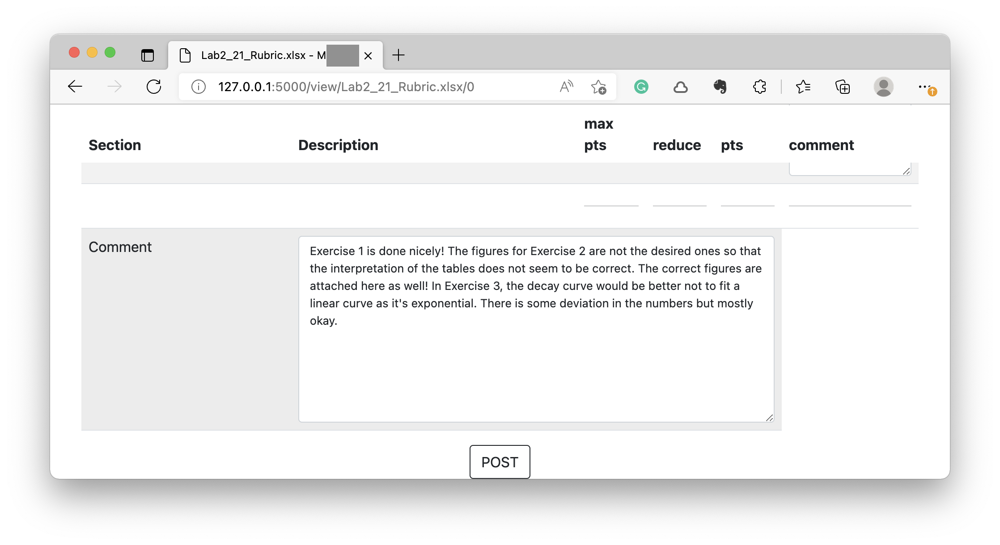
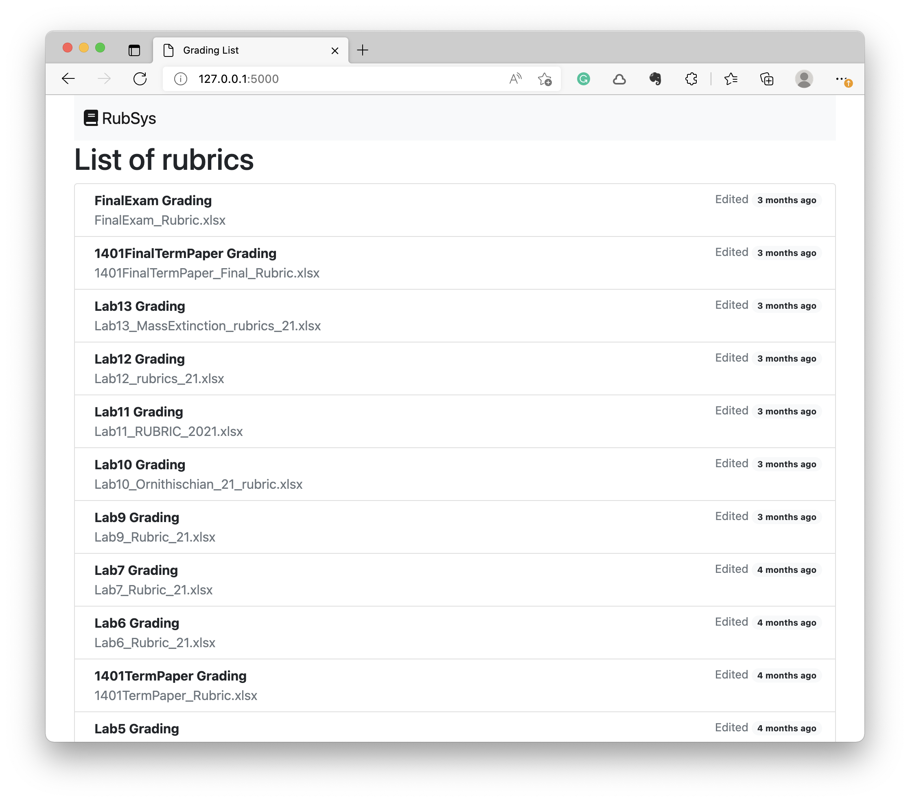
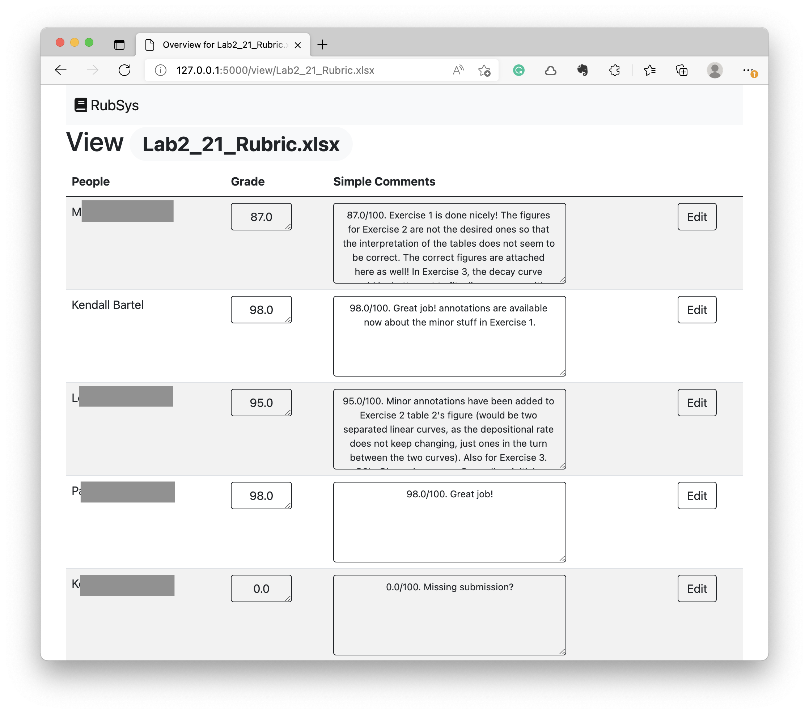
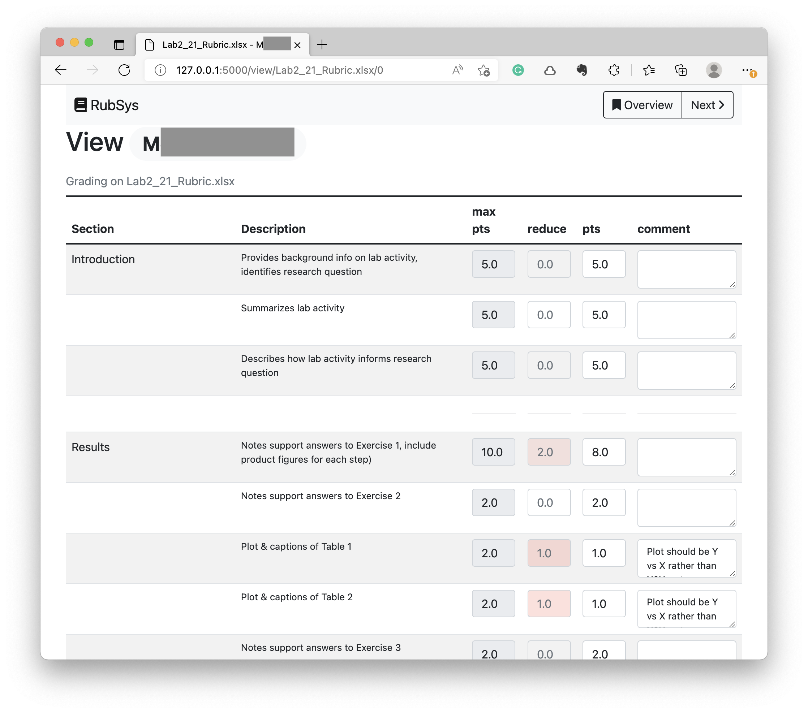

# Dependency
```
pip install timeago
```

# Excecution
Set the environment for this RubSys app
```
export FLASK_APP=main
export FLASK_ENV=development
```
then,
```
flask run
```

# Data

The data used in this web app is simply excel documents (mainly due to the professor's requirement).

An example of the excel table is just like:

| Section  | Description                              | PTS |
| -------- | ---------------------------------------- | --- |
| Abstract | Provides background info on lab activity | 5   |
|          | Summarizes lab activity                  | 5   |
|          |                                          |     |
| Results  | Draw the matrix                          | 3   |
|          | Description of the ..                    | 3   |
| ...      | ...                                      | ... |
|          |                                          |     |
| Comment  |                                          |     |

* Having a "Comment" cell in the first column help enable the adding comment function as belown



# Example



